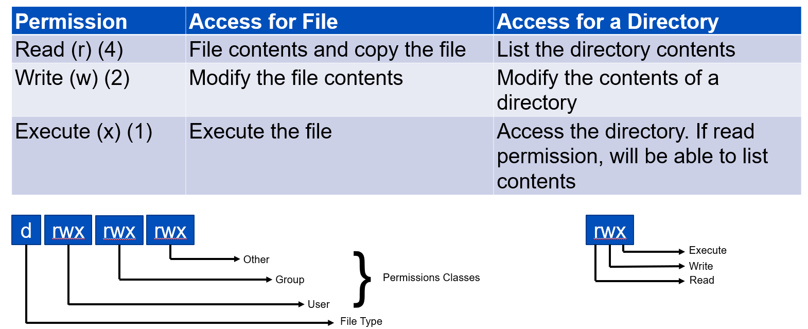

# LAB: Fundamentals of Linux

### <b>1. Command Structure</b>
<br>

**Special Keys Strokes:**  

| Command       | Description           |
| ------------- |:-------------|
| `q`           | quits from many commands like more and less  |
| `Ctrl+c`      | also quits out of many commands    |
| `Ctrl+L`      | clears the screen     |
| `Ctrl+a`      | puts the cursor at the beginning of the command line    |
| `Ctrl+e`      | puts the cursor at the end of the command line    |
<br>

**Help, Search, Info Tools:**  

| Command             | Description           |
| --------------------|:----------------------|
| `env [-opts] [exp]` | Print environment or run a command with another environment  |
| `find [path] [exp]` | Find files in path using exp    |
| `info keyword`      | List info help pages containing keyword      |
| `locate keyword`    | Locate all files of name keyword in a database      |
| `man command`       | Display the manual for command    |
| `set [vars]`        | Print/Set environment vars and functions      |
| `whereis`           | command Locate source/binary and manuals for command   |
| `which`             | command Display path of command    |
<br>

**Text Manipulation Tools** 

| Command                  | Description           |
| -------------------------|:----------------------|
| `awk| gawk [pgrm][file]` | Filter file by pgrm   |
| `cat file`               | Display contents of file without paging  |
| `grep pattern file`      | Finds pattern in file  |
| `head file`              | List the first few lines of file  |
| `more file`              | Display & page the text file (See less)  |
| `sed [script] file`      | Stream edit/filter file using script  |
| `tail [-opts] file`      | List the trailing lines of file |
| `less file`              | Display & page the text file     |
<br>

**General Tools**

 Command                     | Description           |
| ---------------------------|:----------------------|
| `cd dir`                   | Change cwd to dir (home if dir omitted) |
| `chmod perms files`        | Change file permissions of files  |
| `chown owner.group files`  |  Change file owner and/or group |
| `cp [-opts] f1 (f2|dir) `  | Copy file f1 to f2 or directory dir |
| `kill pid`                 | Kills process ID pid |
| `ls [file]`                | Listing for file (cwd if file omitted) |
| `mkdir dir`                | Creates directory dir |
| `mv file1 file2`           | Rename file1 to file2 |
| `ps [-opts]`               | Output a list of currently active processes |
| `pwd`                      | List the current working directory |
| `rm files`                 | Removes files |
| `tar [-opt][arch][file]`   | Manage tar archives |
| `telnet [host] [port]`     | Connect to the remote host |
| `who`                      | List users logged into this system |
<br>

### <b>3. Exercises</b>  

### Please follow the lab guide to login to the VM.

**Note:**  
 
* Commands preceded with `$` imply that you should execute the command as a general user - not as root.
* Commands preceded with `#` imply that you should be working as root.
* If a command line ends with `\` this indicates that the command continues on the next line and you should treat this as a single line.
<br>
<br>

**3.1 Become the root user**   
Login the group VM and type the following command:

    $ sudo -s

Enter your password. This will bring you to the root shell which is indicated by “#” symbol.

**3.2 List files**   
`ls` to list files:

	$ ls

It will list files and folder under your current directory. 

To see the hidden file use `a` flag.

	$ ls -lah 

**3.3 View file**

We can use `cat` or `more` command to view the file:

	$ cat .profile
	$ less .profile

**3.4 Working with the command prompt**  

To check the previous commands by using the up-arrow and down-arrow keys.

Alternately, `history` can be used to list all the previous commands:

	$ history

We can execute the old command by calling the command number:

	 $ !nn

Where “nn” is the number of the command in the history list. 

**3.4.  Copy / Move Files and Directories**  

    $ cp file1 file2

will copy file1 to file2. Copying a folder or directory requires the use of the recursive
or `-r` flag indicating that `cp` should descend into the directory and copy all sub-files and
sub-folders:

    $ cp -r dir1 dir2

We can use `mv` command to move any files or folder.

**3.5. Finding text strings**  

Use the command `grep` to print lines matching a pattern. For example, view the entry for the apnic account in the system passwd file:

 	$ sudo grep apnic /etc/passwd

Will have following output:

`apnic:x:1001:1001:APNIC,,,:/home/apnic:/bin/bash`

You can do the same with pipe `|`

    $ sudo more /etc/passwd | grep apnic

**3.6. Redirection** 
Redirection refers to the art of redirecting input and output traffic from commands. Shells
like bash allow for redirection of stdin and stdout with the < and > operators respectively.

    $ ls -al > output.txt

To check the output, you can use `cat` (short for concatenate). `cat` is useful when you
want to view short files:

    $ cat output.txt

**3.7. Update and installing services**

    $ sudo apt-get update            [update software package repository]
    $ sudo apt-get upgrade           [upgrade the packages]
    $ sudo apt-get install figlet -y [install package figlet]
    $ figlet apnic

**3.8. List all services**

    $ service --status-all

It will show a complete list of services on Ubuntu.

**3.9. Stopping and starting a service**  
We can start, stop or restart services using Systemd systemctl utility. The Syntax is:

    $ sudo systemctl [action] [service name]

To stop a service:

    $ sudo systemctl stop ufw

To start a service:

    $ sudo systemctl start ufw

To restart the service:

    $ sudo systemctl restart ufw

To check the status of service:

    $ sudo systemctl status ufw

**3.9. Check running services / socket**  
It is important for use to verify which ports are listening on the server’s network interfaces. This will help us to troubleshoot and identify whether service is running or not.

It may be necessary to check if a port is already in use by a different application on our servers. For example, we may install Apache and Nginx server on the same system. So it is necessary to know if Apache or Nginx is using TCP port # 80/443.

We can check the listening ports and applications on Linux using multiple commands. Most common ones:

    $ sudo lsof -i -P -n 
    
or

    $ sudo netstat -tulpn

We can use `man` command to check the function of each flags.

**3.10. tail -f**  

It's very common to check what new information is being written to a file (think of log files) for monitoring or troubleshooting. We can use `cat` or `more` command but it will only print on the standard output. To monitor the logs continuously we can use `tail -f` command.

Open up a terminal and run the following command:

    $ sudo tail -f /var/log/auth.log

Now open up another new terminal or login to the server again (ssh). You will see logs are populated with login information.

    Dec  3 14:13:27 group01 sshd[3594165]: Accepted publickey for apnic from 192.168.99.185 port 49614 ssh2: RSA SHA256:WKHXbj/hnSPZizVzzzNSnyD9vBJp26F4gpeEyZpUgKs
    Dec  3 14:13:27 group01 sshd[3594165]: pam_unix(sshd:session): session opened for user apnic by (uid=0)
    Dec  3 14:13:27 group01lxd-home systemd-logind[659]: New session 6788 of user apnic.

**3.11. Pattern scanning** 

`awk` / `gwak` is a pattern scanning and process language. Its Syntax is

    $ awk ’program’ input-files

To get all the users we can use the following command:

    $ gawk -F: '{ print $1 }' /etc/passwd

It will print the first column of `/etc/passwd` file where values are separated by `:`

**3.12. Change file / directory ownership**
We use the `chown` command to change file owner and group information. 

For example, we can list permissions for `/etc/hosts`:

    $ ls -l /etc/hosts

    -rw-r--r-- 1 root root 223 May  1  2020 /etc/hosts

The chown command changes the user and/or group ownership of for given file. The syntax is:

`chown owner-user file`   
`chown owner-user:owner-group file`  
`chown owner-user:owner-group directory`  
`chown options owner-user:owner-group file`  

Lets create a file and change the ownership

    $ date > date.txt

This will save the current date and time to `date.txt` file. Use `cat` or `more` to verify it.

The current ownership for the file `date.txt` is `apnic:apnic`. To change it

    $ sudo chown root:root date.txt

This will change the owner user and group to `root`. We can use `-r` flag to operate on files and directories recursively.

Lets check it back to `apnic:apnic`

    $ sudo chown apnic:apnic date.txt

**3.13. Change file / directory permission**

We run the `chmod` command command to change file access permissions such as read, write, and access. The following table explain the linux permission set:



The syntax is:  

`chmod permission file`  
`chmod permission dir`  

Let check the file we have created in previous set:

    $ ls -lah date.txt
    -rw-rw-r-- 1 apnic apnic 30 Dec  3 14:20 date.txt

The owner and group `apnic` has read and write permission. Others can only read the file, but can't write anything to the file. 

If we like to allow others to write:

    $ sudo chmod 666 date.txt

Verify the changes:

    $ ld -lsh date.txt
    -rw-rw-rw- 1 apnic apnic 30 Dec  3 14:20 date.txt

We can achieve the same with symbolic codes. For example

    $ sudo chmod o+w date.txt

Will do the same. It will add write permission for others. 
> 
>
>
***Tasks:***

A. Login to your lab VM. Write a bash command to get the `nameserver` IP addresses from `/etc/resolv.conf`. The output should look like:

    100.100.250.15
    100.100.250.16

_[Hint: Use `more`, `grep` and `cut` command]_

solution:

    $ sudo more /etc/resolv.conf | grep nameserver  | cut -c 12-28

B. Now remove the line break (`\n`) and replace it with `,` so that the output looks like:

    100.100.250.15,100.100.250.16

_[Hint: Use `tr` with the solution of task A]_

solution:   

    $ sudo more /etc/resolv.conf | grep nameserver  | cut -c 12-28 | tr '\n' ','

C. Finally write a bash script which will ping nameservers and display the output

_[Hint: Get the solution of task B output in a array and loop through the output]_

solution: bash script `dnsping.sh`

```
#!/bin/bash
DNS=$(sudo more /etc/resolv.conf | grep nameserver  | cut -c 12-28 | tr '\n' ',')

IFS="," read -a DNSARRAY <<< $DNS

for i in "${DNSARRAY[@]}"
do
        ping -c 1 "$i"
        echo "-------------------------------------------------"
done
```


**End of Lab**