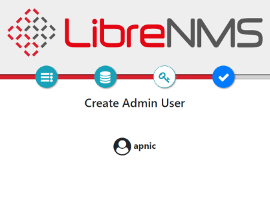
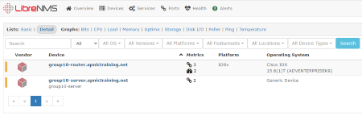

# LAB: SNMP Lab - LibreNMS


#### Please follow the lab guide to login to the VM.
<br>
**Note:**  

* Commands preceded with `$` imply that you should execute the command as a general user - not as root.
* Commands preceded with `#` imply that you should be working as root.
* If a command line ends with `\` this indicates that the command continues on the next line and you should treat this as a single line.
<br>
<br>

**1. Install Required Packages**  
Update the package index for the APT package manager:
    
    $ sudo apt install software-properties-common apt-transport-https
    $ sudo add-apt-repository universe
    $ sudo add-apt-repository ppa:ondrej/php
    $ wget https://downloads.mariadb.com/MariaDB/mariadb_repo_setup
    $ wget https://downloads.mariadb.com/MariaDB/mariadb_repo_setup.sha256
    $ sha256sum -c mariadb_repo_setup.sha256
    $ chmod +x mariadb_repo_setup
    $ sudo ./mariadb_repo_setup \
    --mariadb-server-version="mariadb-10.5"
    $ sudo apt update
    $ sudo apt install curl apache2 composer fping git graphviz imagemagick \
    libapache2-mod-php7.4 mariadb-client mariadb-server mtr-tiny nmap php7.4-cli \
    php7.4-curl php7.4-gd php7.4-json php7.4-mbstring php7.4-mysql php7.4-snmp \
    php7.4-xml php7.4-zip python-memcache python-mysqldb rrdtool snmp snmpd \
    whois python3-pip unzip
    

<br>
** Note: **

* Keep track of the versions of packages that are being installed here.
* This could become problematic in later labs.

**2. Add librenms user**

    $ sudo useradd librenms -d /opt/librenms -M -r
    $ sudo usermod -a -G librenms www-data

<br>

**3. Download LibreNMS**

    $ cd /opt
    $ sudo git clone https://github.com/librenms/librenms.git

<br>

**4. Set permissions**

    $ sudo chown -R librenms:librenms /opt/librenms
    $ sudo chmod 770 /opt/librenms
    $ sudo setfacl -d -m g::rwx /opt/librenms/rrd /opt/librenms/logs \
    /opt/librenms/bootstrap/cache/ /opt/librenms/storage/
    $ sudo setfacl -R -m g::rwx /opt/librenms/rrd /opt/librenms/logs \
    /opt/librenms/bootstrap/cache/ /opt/librenms/storage/

<br>

**5. Install PHP dependencies**

    $ sudo su
    $ su - librenms
    $ ./scripts/composer_wrapper.php install --no-dev
    $ exit
    $ exit

<br>

**6. Configure MySQL**

    $ sudo systemctl restart mysql
    $ sudo mysql --user=root mysql

NOTE: For the lab purpose we are using `training` as password

```bash
CREATE DATABASE librenms CHARACTER SET utf8 COLLATE utf8_unicode_ci;
CREATE USER 'librenms'@'localhost' IDENTIFIED BY 'training';
GRANT ALL PRIVILEGES ON librenms.* TO 'librenms'@'localhost';
FLUSH PRIVILEGES;
exit
```
    $ sudo vi /etc/mysql/mariadb.conf.d/50-server.cnf

Within the [mysqld] section please add:

```bash
innodb_file_per_table=1
lower_case_table_names=0
```

Save and exit (:wq)

    $ sudo systemctl restart mysql

<br>

**7. Configure PHP**

Ensure date.timezone is set in php.ini to your preferred time zone. See http://php.net/manual/en/timezones.php for a list of supported timezones. Valid examples are: "America/New_York", "Australia/Brisbane", "Etc/UTC".

    $sudo vi /etc/php/8.1/apache2/php.ini
    $sudo vi /etc/php/8.1/cli/php.ini

After changing

    $ sudo a2enmod php8.1
    $ sudo a2dismod mpm_event
    $ sudo a2enmod mpm_prefork

<br>

**8. Configure Apache**

    $ sudo vi /etc/apache2/sites-available/librenms.conf

Add the following config, edit ServerName as required. Replace `X` with group number:

```bash
<VirtualHost *:80>
  DocumentRoot /opt/librenms/html/
  ServerName  groupX-server.apnictraining.net

  AllowEncodedSlashes NoDecode
  <Directory "/opt/librenms/html/">
    Require all granted
    AllowOverride All
    Options FollowSymLinks MultiViews
  </Directory>
</VirtualHost>
```

Enable the config and reload `apache`

    $ sudo a2ensite librenms.conf
    $ sudo a2enmod rewrite
    $ sudo systemctl restart apache2

<br>

**9. Configure snmpd**

_Note: Skip this part if you have successfull done NetSNMP Lab_

    $ sudo cp /opt/librenms/snmpd.conf.example /etc/snmp/snmpd.conf
    $ sudo vi /etc/snmp/snmpd.conf

Edit the text `RANDOMSTRINGGOESHERE` to `training`. Also change `syslocation` and `syscontact` accordingly.

<br>

**10. Enable distro script**

This script will detect which OS and if it is Linux then it will detect which Linux Distribution.

    $ sudo curl -o /usr/bin/distro \
    https://raw.githubusercontent.com/librenms/librenms-/\
    agent/master/snmp/distro
    $ sudo chmod +x /usr/bin/distro
    $ sudo systemctl restart snmpd

<br>

**10. Cron job**

    $ sudo cp /opt/librenms/librenms.nonroot.cron /etc/cron.d/librenms

<br>

Clean up the default installers

```
cd /etc/apache2/sites-enabled/
sudo rm 000-default.conf
sudo systemctl restart apache2
```


**11. Web installer**

Now head to the web installer (open in a browser) and follow the on-screen instructions.

**_If you are attending this session remotely, please refer to the lab access instructions for access to web interface_**

http://groupX-server.apnictraining.net

Please follow the configuration steps which are self explanatory. Following screenshots are attached as reference.

Pre-Install checks


Click on the DB icon. Put `training` as password. Rest of the information will remain same and click on `Check Credentials`


Expand `Build Database` and click `Build Database`


Next step is to create a admin user. For the lab admin username would be `apnic` and password `training`.


LibreNMS will confirm that user `apnic` as been added successfully



Finally click on the tick icon and finish the installation. You can check `validate your install` if required.


**12. Fix additional permission**

The web installer might prompt you to create a config.php file in your librenms install location manually, copying the content displayed on-screen to the file. If you have to do this, please remember to set the permissions on config.php after you copied the on-screen contents to the file. Run:

    $ sudo chown librenms:librenms /opt/librenms/config.php

**13. Add devices**

Login to LibreNMS (open in a browser) `http://groupX-server.apnictraining.net`. Replace `X` with group number

Go to Devices > Add Device. Add your group server and router. Following screenshot shows information related to `group10`


After sometime LibreNMS will start pulling all the information.




**End of Lab**
