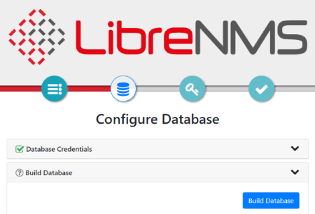
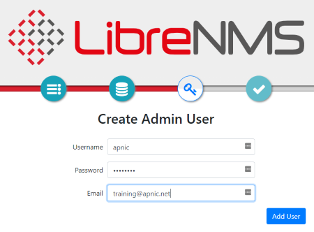
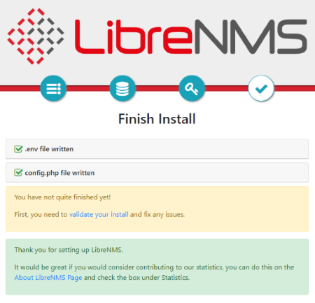
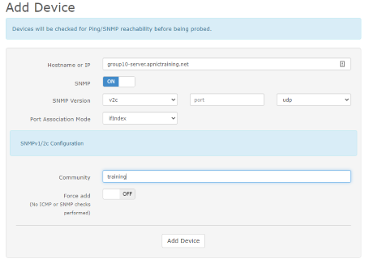

# LAB: SNMP Lab - LibreNMS


#### Please follow the lab guide to login to the VM.
<br>
**Note:**  

* Commands preceded with `$` imply that you should execute the command as a general user - not as root.
* Commands preceded with `#` imply that you should be working as root.
* If a command line ends with `\` this indicates that the command continues on the next line and you should treat this as a single line.
<br>
<br>

**1. Install Required Packages**  
Update the package index for the APT package manager:
```
$ sudo apt update
$ sudo apt install -y cron acl curl fping git graphviz imagemagick mariadb-client \
mariadb-server mtr-tiny nginx-full nmap php-cli php-curl \
php-fpm php-gd php-gmp php-json php-mbstring php-mysql \
php-snmp php-xml php-zip rrdtool snmp snmpd unzip \
python3-pymysql python3-dotenv python3-redis \
python3-setuptools python3-systemd python3-pip whois traceroute
```

<br>
** Note: **

* Keep track of the versions of packages that are being installed here.
* This could become problematic in later labs.

**2. Add librenms user**
```
$ sudo useradd librenms -d /opt/librenms -M -r -s "$(which bash)"
```

<br>

**3. Download LibreNMS**
```
$ cd /opt
$ sudo git clone https://github.com/librenms/librenms.git
```

<br>

**4. Set permissions**
```
$ sudo chown -R librenms:librenms /opt/librenms
$ sudo chmod 771 /opt/librenms
$ sudo setfacl -d -m g::rwx /opt/librenms/rrd /opt/librenms/logs /opt/librenms/bootstrap/cache/ /opt/librenms/storage/
$ sudo setfacl -R -m g::rwx /opt/librenms/rrd /opt/librenms/logs /opt/librenms/bootstrap/cache/ /opt/librenms/storage/
```

<br>

**5. Install PHP dependencies**
```
$ sudo su - librenms
$ ./scripts/composer_wrapper.php install --no-dev
$ exit
```
<br>

**6. Set the Timezone**

Ensure date.timezone is set in php.ini to your preferred time zone. See http://php.net/manual/en/timezones.php for a list of supported timezones. Valid examples are: "America/New_York", "Australia/Brisbane", "Etc/UTC".<BR>
_Hint: search for date.timezone_<BR>

```bash
$ sudo vi /etc/php/8.1/fpm/php.ini
$ sudo vi /etc/php/8.1/cli/php.ini
```
Remember to set the System timezone as well eg. Brisbane

```bash
$ sudo timedatectl set-timezone Australia/Brisbane
```

**7. Configure MariaDB**

```
$ sudo vi /etc/mysql/mariadb.conf.d/50-server.cnf
```

Within the [mysqld] section please add:

```bash
innodb_file_per_table=1
lower_case_table_names=0
```
Then restart MariaDB
```bash
$ sudo systemctl enable mariadb
$ sudo systemctl restart mariadb
```
_**NOTE: For the lab purpose we are using `training` as password**_

We now need to log into MariaDB and create the databases for LibreNMS

```bash
$ sudo mysql -u root
```

```bash
CREATE DATABASE librenms CHARACTER SET utf8 COLLATE utf8_unicode_ci;
CREATE USER 'librenms'@'localhost' IDENTIFIED BY 'training';
GRANT ALL PRIVILEGES ON librenms.* TO 'librenms'@'localhost';
FLUSH PRIVILEGES;
exit
```


**8. Configure PHP-FPM**
We will start by copying some templates and then edit the files
```bash
$ sudo cp /etc/php/8.1/fpm/pool.d/www.conf /etc/php/8.1/fpm/pool.d/librenms.conf

```
Edit the `/etc/php/8.1/fpm/pool.d/librenms.conf` by chaning `[www]` to `[librenms]`

and change the user and group to `lilbrenms` as well as change the listner socket for FPM
```bash
user = librenms
group = librenms
listen = /run/php-fpm-librenms.sock
```


<br>

**9. Configure NGINX**
Create the `librenms.conf` (using your editor of choice)
```bash 
$ sudo vi /etc/nginx/conf.d/librenms.conf
```
and add the following, substituing your server name
```bash
server {
 listen      80;
 server_name librenms.example.com;
 root        /opt/librenms/html;
 index       index.php;

 charset utf-8;
 gzip on;
 gzip_types text/css application/javascript text/javascript application/x-javascript image/svg+xml text/plain text/xsd text/xsl text/xml image/x-icon;
 location / {
  try_files $uri $uri/ /index.php?$query_string;
 }
 location ~ [^/]\.php(/|$) {
  fastcgi_pass unix:/run/php-fpm-librenms.sock;
  fastcgi_split_path_info ^(.+\.php)(/.+)$;
  include fastcgi.conf;
 }
 location ~ /\.(?!well-known).* {
  deny all;
 }
}
```

Remove the default site and restart the nginx and FPM processes
```bash
$ sudo rm /etc/nginx/sites-enabled/default
$ sudo systemctl restart nginx
$ sudo systemctl restart php8.1-fpm
```


**10. Configure snmpd**

_**Note: Skip this part if you have successfull done NetSNMP Lab**_

    $ sudo cp /opt/librenms/snmpd.conf.example /etc/snmp/snmpd.conf
    $ sudo vi /etc/snmp/snmpd.conf

Edit the text `RANDOMSTRINGGOESHERE` to `training`. Also change `syslocation` and `syscontact` accordingly.

<br>

**11. Cron job**
Copy overt he LibreNMS cron job
```bash
$ sudo cp /opt/librenms/dist/librenms.cron /etc/cron.d/librenms
```
Enable the LibreNMS scheduler
```bash
$ sudo cp /opt/librenms/dist/librenms-scheduler.service /opt/librenms/dist/librenms-scheduler.timer /etc/systemd/system/

$ sudo systemctl enable librenms-scheduler.timer
$ sudo systemctl start librenms-scheduler.timer
```
<br>

Copy the Logrotate Config
```bash
$ sudo cp /opt/librenms/misc/librenms.logrotate /etc/logrotate.d/librenms
```


**11. Web installer**

Now head to the web installer (open in a browser) and follow the on-screen instructions.

**_If you are attending this session remotely, please refer to the lab access instructions for access to web interface_**

http://groupX-server.apnictraining.net OR http://172.18.X.X

Please follow the configuration steps which are self explanatory. Following screenshots are attached as reference.

Pre-Install checks


Click on the DB icon. Put `training` as password. Rest of the information will remain same and click on `Check Credentials`


Expand `Build Database` and click `Build Database`



Next step is to create a admin user. For the lab admin username would be `apnic` and password `training`.



LibreNMS will confirm that user `apnic` as been added successfully


Finally click on the tick icon and finish the installation. You can check `validate your install` if required.



**12. Fix additional permission**

The web installer might prompt you to create a config.php file in your librenms install location manually, copying the content displayed on-screen to the file. If you have to do this, please remember to set the permissions on config.php after you copied the on-screen contents to the file. Run:

    $ sudo chown librenms:librenms /opt/librenms/config.php

**13. Add devices**

Login to LibreNMS (open in a browser) `http://groupX-server.apnictraining.net`. Replace `X` with group number

Go to Devices > Add Device. Add your group server and router. Following screenshot shows information related to `group10`



After sometime LibreNMS will start pulling all the information.


**End of Lab**
