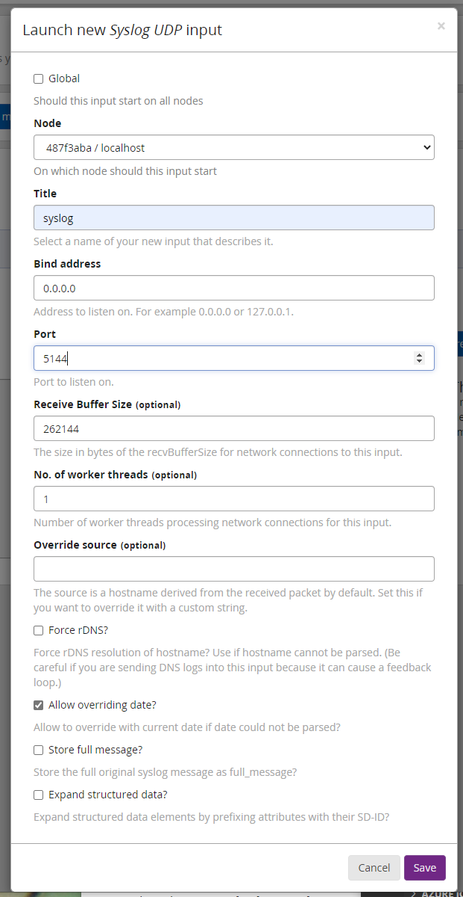
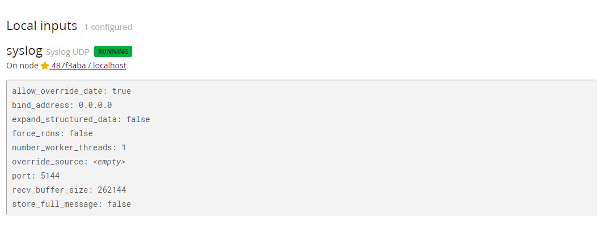
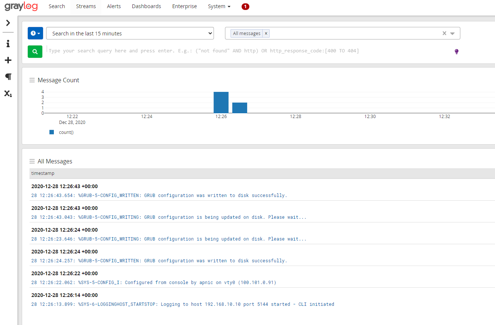

# LAB: Log Management Lab - Graylog 


#### Please follow the lab guide to login to the VM.
<br>
**Note:**  

* Commands preceded with `$` imply that you should execute the command as a general user - not as root.
* Commands preceded with `#` imply that you should be working as root.
* If a command line ends with `\` this indicates that the command continues on the next line and you should treat this as a single line.


| Note: Graylog requires a reasonably modern multicore CPU and 4 GB of main memory to function properly. Please check with your instructor to make sure adequate resources are allocated to your group before doing the lab |
| --- |

**1. Install Required Packages**  

Update the package index for the APT package manager and install necessary packages:

    $ sudo apt-get update
    $ sudo apt-get install apt-transport-https openjdk-8-jre-headless \
    uuid-runtime pwgen

If you get an error stating Unable to locate package, you likely need to enable the universe repository which can be done typing the below command, and subsequent commands as follows:

    $ sudo add-apt-repository universe
    $ sudo apt-get update
    $ sudo apt-get install apt-transport-https openjdk-8-jre-headless \
    uuid-runtime pwgen
<br>

**2. Install MongoDB**  

The official MongoDB repository provides the most up-to-date version and is the recommended way of installing MongoDB:  

    $ sudo apt-key adv --keyserver hkp://keyserver.ubuntu.com:80 \
    --recv 9DA31620334BD75D9DCB49F368818C72E52529D4
    $ sudo bash -c 'echo "deb http://repo.mongodb.org/apt/ubuntu \
    bionic/mongodb-org/4.0 multiverse" > /etc/apt/sources.list.d\
    /mongodb-org-4.0.list'
    $ sudo apt-get update
    $ sudo apt-get install -y mongodb-org

The next step is to enable MongoDB during the operating system’s startup and verify it is running:  

    $ sudo systemctl daemon-reload
    $ sudo systemctl enable mongod.service
    $ sudo systemctl restart mongod.service
    $ sudo systemctl --type=service --state=active | grep mongod
<br>

**3. Install Elasticsearch**  

Graylog can be used with Elasticsearch 7.x, please follow the below instructions to install the open source version of Elasticsearch.

    $ wget -q https://artifacts.elastic.co/GPG-KEY-elasticsearch -O myKey
    $ sudo apt-key add myKey
    $ echo "deb https://artifacts.elastic.co/packages/oss-7.x/apt stable main" | \
    sudo tee -a /etc/apt/sources.list.d/elastic-7.x.list
    $ sudo apt-get update && sudo apt-get install elasticsearch-oss

Modify the Elasticsearch configuration file (`/etc/elasticsearch/elasticsearch.yml`) and set the cluster name to `graylog` and uncomment `action.auto_create_index: false` to enable the action:

    $ sudo tee -a /etc/elasticsearch/elasticsearch.yml > /dev/null <<EOT
    cluster.name: graylog
    action.auto_create_index: false
    EOT

Due to memory limitations on our hosts, we will need to lower the amount of memory that Elastisearch wants to use.
We do this by creating an ```.options```  file in ```/etc/elastisearch/jvm.options.d/```

```bash
$ sudo tee -a /etc/elasticsearch/jvm.options.d/lowmem.options > /dev/null <<EOT
-Xms512m
-Xmx512m
EOT
```

After you have modified the configuration, you can start Elasticsearch and verify it is running.

    $ sudo systemctl daemon-reload
    $ sudo systemctl enable elasticsearch.service
    $ sudo systemctl restart elasticsearch.service
    $ sudo systemctl --type=service --state=active | grep elasticsearch
<br>

**4. Install Graylog**  

Now install the Graylog repository configuration and Graylog itself with the following commands:

    $ wget https://packages.graylog2.org/repo/packages\
    /graylog-4.0-repository_latest.deb
    $ sudo dpkg -i graylog-4.0-repository_latest.deb
    $ sudo apt-get update && sudo apt-get install graylog-server
<br>

**5. Configure Graylog**  

Next you need to edit `/etc/graylog/server/server.conf` file. Additionally add `password_secret` and `root_password_sha2` as these are mandatory and Graylog will not start without them.

To create your root_password_sha2 run the following command:

    $ echo -n "Enter Password: " && head -1 </dev/stdin \
    | tr -d '\n' | sha256sum | cut -d" " -f1

For the lab we will use `training` as password. And also change the `http_bind_address`. Replace `XX` and `YY` with your Cluster and group number.

    $ sudo vi /etc/graylog/server/server.conf
    
    password_secret = c2fb788c7deedbeaa296e424d4c2921b871a4f6cb4cf393c1c1105653ab399b4
    root_password_sha2 = c2fb788c7deedbeaa296e424d4c2921b871a4f6cb4cf393c1c1105653ab399b4
    http_bind_address = 172.18.XX.YY:9000

Save and exit.

The last step is to enable Graylog during the operating system’s startup and verify it is running.

    $ sudo systemctl daemon-reload
    $ sudo systemctl enable graylog-server.service
    $ sudo systemctl start graylog-server.service
    $ sudo systemctl --type=service --state=active | grep graylog

If graylog is running successfully you will see the following log:

    $ sudo tail -f /var/log/graylog-server/server.log
    
    2020-12-28T10:57:25.383+10:00 INFO  [JerseyService] Started REST API at <192.168.10.10:9000>
    2020-12-28T10:57:25.387+10:00 INFO  [ServerBootstrap] Services started, startup times in ms: {GracefulShutdownService [RUNNING]=81, InputSetupService [RUNNING]=83, EtagService [RUNNING]=126, JobSchedulerService [RUNNING]=126, OutputSetupService [RUNNING]=126, UrlWhitelistService [RUNNING]=127, JournalReader [RUNNING]=127, ConfigurationEtagService [RUNNING]=128, BufferSynchronizerService [RUNNING]=129, KafkaJournal [RUNNING]=129, MongoDBProcessingStatusRecorderService [RUNNING]=157, PeriodicalsService [RUNNING]=232, StreamCacheService [RUNNING]=243, LookupTableService [RUNNING]=248, JerseyService [RUNNING]=21668}
    2020-12-28T10:57:25.391+10:00 INFO  [ServerBootstrap] Graylog server up and running.
    2020-12-28T10:57:25.392+10:00 INFO  [ServiceManagerListener] Services are healthy

**_If you are doing the lab on-line/remote, refer to the lab access guide for instructions on creating a tunnel with ssh_**

Now you can access graylog web interface `http://groupX-server.apnictraining.net:9000/`. Replace `X` with group number. Login with username `admin` and password `training`.

**6. Create input pipeline and receive syslog**  

First we need to create input pipeline to receive syslog message. 

Goto System > Inputs. From the select input drop down choose `Syslog UDP` and click on `Launch new input`  


From Launch new Syslog UDP input select the following option:

Node: `localhost`  
Title: `syslog`  
Bind Address: `0.0.0.0`  
Port: `5144`  



This will create a new pipeline to receive UDP syslog message on port 5144. 



Login to your group router and add the following configuration. Replace `X` with your group number:

    # conf t
    (config)# logging host 192.168.X.10 transport udp port 5144
    (config)# logging facility local0
    (config)# logging userinfo
    (config)# exit
    # write memory

Go to Streams > All Messages from Graylog menu. After sometime you will see syslog message are coming to graylog. 




<br>
<br>
**End of Lab**