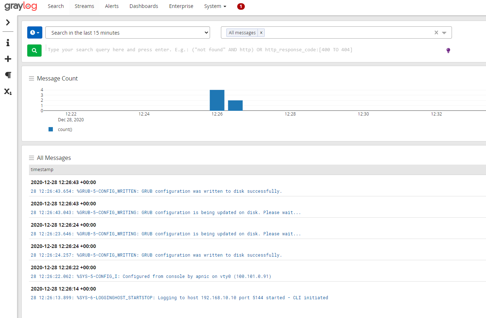

# LAB: Log Management Lab - Graylog 


#### Please follow the lab guide to login to the VM.
<br>
**Note:**  

* Commands preceded with `$` imply that you should execute the command as a general user - not as root.
* Commands preceded with `#` imply that you should be working as root.
* If a command line ends with `\` this indicates that the command continues on the next line and you should treat this as a single line.


| Note: Graylog requires a reasonably modern multicore CPU and 4 GB of main memory to function properly. Please check with your instructor to make sure adequate resources are allocated to your group before doing the lab |
| --- |


**1. Install Pre-requisit Packages**
The following packages are required for the initial install stage:
```bash
$ sudo apt-get install gnupg curl
```

**2. Install MongoDB**  

The official MongoDB repository provides the most up-to-date version and is the recommended way of installing MongoDB <BR>
(_Please note that Graylog does not support MongoDB versions **ABOVE** 6.X_):  

```bash
 $ curl -fsSL https://www.mongodb.org/static/pgp/server-6.0.asc | \
   sudo gpg -o /usr/share/keyrings/mongodb-server-6.0.gpg \
   --dearmor
$ echo "deb [ arch=amd64,arm64 signed-by=/usr/share/keyrings/mongodb-server-6.0.gpg ] \
https://repo.mongodb.org/apt/ubuntu jammy/mongodb-org/6.0 multiverse" \
| sudo tee /etc/apt/sources.list.d/mongodb-org-6.0.list
$ sudo apt-get update
$ sudo apt-get install -y mongodb-org
```
The next step is to enable MongoDB during the operating system’s startup and verify it is running:  
```bash
$ sudo systemctl daemon-reload
$ sudo systemctl enable mongod.service
$ sudo systemctl restart mongod.service
$ sudo systemctl --type=service --state=active | grep mongod
```
<br>

**3. Install OpenSearch**  

Graylog can be used with OpenSearch 1.x and 2.x please follow the below instructions to install OpenSearch.
```bash
$ cd /tmp
$ wget -q https://artifacts.opensearch.org/releases/bundle/opensearch/2.14.0/opensearch-2.14.0-linux-x64.deb
$ sudo env OPENSEARCH_INITIAL_ADMIN_PASSWORD=APnic_Tr@in1ng dpkg -i opensearch-2.14.0-linux-x64.deb
```

Modify the OpenSearch configuration file (`/etc/opensearch/opensearch.yml`) and set the file to have the following minimum configurations(Search the file as some of these will already exist):
```bash
cluster.name: graylog
node.name: ${HOSTNAME}
path.data: /var/lib/opensearch
path.logs: /var/log/opensearch
discovery.type: single-node
network.host: 0.0.0.0
action.auto_create_index: false
plugins.security.disabled: true
indices.query.bool.max_clause_count: 32768
```

Due to memory limitations on our hosts, we will need to lower the amount of memory that OpenSearch wants to use.
We do this by editing the `/etc/opensearch/jvm.options` file.
Update the `-Xms1g` and `Xmx1g` as follows

```bash
-Xms512m
-Xmx512m
```

After you have modified the configuration, you can start OpenSearch and verify it is running.
```bash
$ sudo systemctl daemon-reload
$ sudo systemctl enable opensearch
$ sudo systemctl start opensearch
$ sudo systemctl status opensearch
```


**4. Install Graylog**  

Now install the Graylog repository configuration and Graylog itself with the following commands:
```bash
$ cd /tmp
$ wget https://packages.graylog2.org/repo/packages/graylog-5.0-repository_latest.deb
$ sudo dpkg -i graylog-5.0-repository_latest.deb
$ sudo apt update
$ sudo apt-cache policy graylog-server
$ sudo apt-get install graylog-server=5.0.3-1
```
<br>

**5. Configure Graylog**  

Next you need to edit `/etc/graylog/server/server.conf` file. Additionally add `password_secret` and `root_password_sha2` as these are mandatory and Graylog will not start without them.

To create your root_password_sha2 run the following command:

    $ echo -n "Enter Password: " && head -1 </dev/stdin \
    | tr -d '\n' | sha256sum | cut -d" " -f1

For the lab we will use `training` as password. And also change the `http_bind_address`. Replace `XX` and `YY` with your Cluster and group number.
_**Hint:** Check free space with `df -h` prior to setting the message journal max size below.  If need be, clean up the `/tmp` folder(`rm -rf /tmp/*`)

```bash
$ sudo nano /etc/graylog/server/server.conf

password_secret = c2fb788c7deedbeaa296e424d4c2921b871a4f6cb4cf393c1c1105653ab399b4
root_password_sha2 = c2fb788c7deedbeaa296e424d4c2921b871a4f6cb4cf393c1c1105653ab399b4
http_bind_address = 172.18.XX.YY:9000
message_journal_max_size = 1gb
```
Save and exit.

The last step is to enable Graylog during the operating system’s startup and verify it is running.
```bash
$ sudo systemctl daemon-reload
$ sudo systemctl enable graylog-server.service
$ sudo systemctl start graylog-server.service
$ sudo systemctl --type=service --state=active | grep graylog
```

If graylog is running successfully you will see the following log:

    $ sudo tail -f /var/log/graylog-server/server.log
    
    2020-12-28T10:57:25.383+10:00 INFO  [JerseyService] Started REST API at <192.168.10.10:9000>
    2020-12-28T10:57:25.387+10:00 INFO  [ServerBootstrap] Services started, startup times in ms: {GracefulShutdownService [RUNNING]=81, InputSetupService [RUNNING]=83, EtagService [RUNNING]=126, JobSchedulerService [RUNNING]=126, OutputSetupService [RUNNING]=126, UrlWhitelistService [RUNNING]=127, JournalReader [RUNNING]=127, ConfigurationEtagService [RUNNING]=128, BufferSynchronizerService [RUNNING]=129, KafkaJournal [RUNNING]=129, MongoDBProcessingStatusRecorderService [RUNNING]=157, PeriodicalsService [RUNNING]=232, StreamCacheService [RUNNING]=243, LookupTableService [RUNNING]=248, JerseyService [RUNNING]=21668}
    2020-12-28T10:57:25.391+10:00 INFO  [ServerBootstrap] Graylog server up and running.
    2020-12-28T10:57:25.392+10:00 INFO  [ServiceManagerListener] Services are healthy


Now you can access graylog web interface `http://172.18.X.X:9000/`. Replace `X` with group number. Login with username `admin` and password `training`.

**6. Create input pipeline and receive syslog**  

First we need to create input pipeline to receive syslog message. 

Goto System > Inputs. From the select input drop down choose `Syslog UDP` and click on `Launch new input`  


From Launch new Syslog UDP input select the following option:

Node: `localhost`  
Title: `syslog`  
Bind Address: `0.0.0.0`  
Port: `5144`  


This will create a new pipeline to receive UDP syslog message on port 5144. 


Login to your group router and add the following configuration. Replace `X` with your group number:

    # conf t
    (config)# logging host 192.168.X.10 transport udp port 5144
    (config)# logging facility local0
    (config)# logging userinfo
    (config)# exit
    # write memory

Go to Streams > Default Stream from Graylog menu. After sometime you will see syslog message are coming to graylog. 




<br>
<br>
**End of Lab**