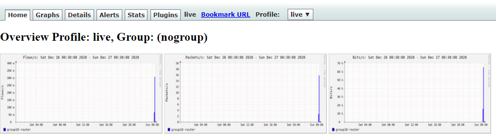

# LAB: Flow Monitor Lab - Nfdump & NfSen


#### Please follow the lab guide to login to the VM.
<br>
**Note:**  

* Commands preceded with `$` imply that you should execute the command as a general user - not as root.
* Commands preceded with `#` imply that you should be working as root.
* If a command line ends with `\` this indicates that the command continues on the next line and you should treat this as a single line.
<br>
<br>

**1. Install Nfdump**  

Nfdump is a collection of tools for collecting and processing NetFlow data.

First we clone the repository using `git clone` command:

    $ git clone https://github.com/phaag/nfdump.git
    $ cd nfdump

Install the necessary dependencies:

    $ sudo apt install make gcc flex rrdtool librrd-dev libpcap-dev php \
    librrds-perl libsocket6-perl apache2 libapache2-mod-php7.2 libtool \
    dh-autoreconf pkg-config libbz2-dev byacc doxygen graphviz cpanminus unzip


The toolset is built upon the autotools framework. Run:

    $ sudo ./autogen.sh
    $ sudo ./configure --enable-nsel \
    --enable-nfprofile --enable-sflow --enable-readpcap --enable-nfpcapd

Compile and install nfdump:

    $ sudo make
    $ sudo make install

Check nfdump version

    $ nfdump -V

If you get any error related to `libnfdump-1.6.22.so`:

    nfdump: error while loading shared libraries: libnfdump-1.6.22.so: cannot open shared object file: No such file or directory

Run the following command:

    $ sudo ldconfig

Try run `nfdump -V` again. You will get some output something like:  

    nfdump: Version: NSEL-NEL1.6.22
<br>

**2. Install NfSen**  

Download `nfsen` stable version from sourceforge

    $ cd /home/apnic
    $ wget https://github.com/p-alik/nfsen/archive/nfsen-1.3.8.zip
    $ unzip nfsen-1.3.8.zip
    $ cd nfsen-nfsen-1.3.8/

Install the necessary dependencies:

    $ sudo cpan App::cpanminus
    $ sudo cpanm Mail::Header
    $ sudo cpanm Mail::Internet

Set the users appropriately so that Apache can access files:

    $ vi ./etc/nfsen-dist.conf
    
    $WWWUSER = 'www-data';
    $WWWGROUP = 'www-data';

Find the `%sources` definition, and change it to:

    %sources=(
    'groupX-router' => {'port'=>'9995','col'=>'#0000ff','type'=>'netflow'},
    );    

Change the HTMLDIR from /var/www/nfsen/ to /var/www/html/nfsen/

    $HTMLDIR    = "/var/www/html/nfsen/";   

Now save and exit from the file.

Next we will create the netflow directory and user on the system

    $ sudo mkdir -p /data/nfsen
    $ sudo useradd -d /data/nfsen -M -s /bin/false -G www-data netflow

Install nfsen:

    $ sudo ./install.pl ./etc/nfsen-dist.conf

Press ENTER when prompted for the path to Perl.

After successful installation the output will look like:

    Profile live: spool directories:
    Exists: group10-router
    Rename gif RRDfiles ... done.
    RRD DB 'group10-router.rrd' already exists!
    Use existing profile info for profile 'live'
    
    Rebuilding profile stats for './live'
    Reconfig: No changes found!
    Setup done.

Start nfsen service:

    $ sudo /data/nfsen/bin/nfsen start
**_If you are doing this lab via online/remote training, please check the lab access handout for instructions on connecting to the web interface_**

Browse to: http://groupX-server.apnictraining.net/nfsen/nfsen.php  
[replace `x` with your group number ]

To make nfsen reboot proof:

    $ sudo ln -s /data/nfsen/bin/nfsen /etc/init.d/nfsen
    $ sudo update-rc.d nfsen defaults 20

<br>

**3. Export flow from router**  

Login to your group router. Add the following configuration:  
```bash
config t
!
flow exporter EXPORTER
destination 192.168.X.10      # replace X with your group number
transport udp 9995
template data timeout 60
!
flow monitor FLOW-MONITOR-V4
exporter EXPORTER
record netflow ipv4 original-input
cache timeout active 300
!
interface GigabitEthernet0/1
ip flow monitor FLOW-MONITOR-V4 input
ip flow monitor FLOW-MONITOR-V4 output
!
exit
exit
!
wr mem
```
To verify the configuration run the following command:  

    show flow exporter
    show flow monitor

Generate some traffic using `iperf` command. Ask instructor regarding the `iperf` server and port details

    $ iperf -c 100.100.250.12 -p 5201 -t 30 -b 1M -Z

[Here `100.100.250.12` is the iperf3 server and `5201` is the port number.]

If `iperf` command missing install it using `sudo apt install iperf` command.

After sometime browse nfsen and check whether it's generating any graph:



<br>
<br>
**End of Lab**
