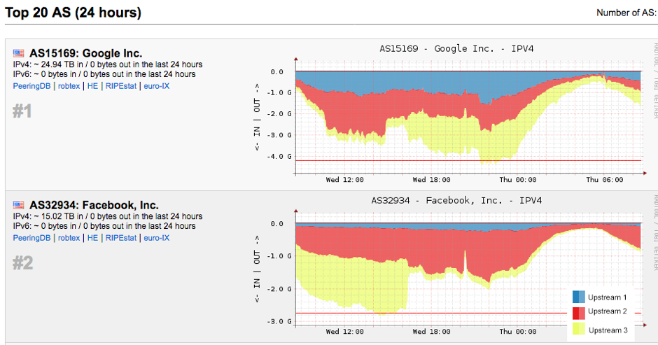

# LAB: Flow Monitor Lab - AS-Stats  

#### Please follow the lab guide to login to the VM.
 
**Note:**  

* Commands preceded with `$` imply that you should execute the command as a general user - not as root.
* Commands preceded with `#` imply that you should be working as root.
* If a command line ends with `\` this indicates that the command continues on the next line and you should treat this as a single line.
 
 

**1. Install Required Packages**  

A simple tool to generate per-AS traffic graphs from NetFlow/sFlow records.  

Update the package index for the APT package manager and install necessary packages:

    $ sudo apt-get update
    $ sudo apt-get install librrds-perl librrd-dev rrdtool \
    apache2 php7.2 make gcc git libapache2-mod-php7.2 \
    libnet-patricia-perl libjson-xs-perl libtrycatch-perl \
    php-sqlite3 -y

The program comes with a default Perl installation, but you may need to install a few extra Perl modules. Check them from cpan:

    $ sudo cpan install File::Find::Rule
    $ sudo cpan install Net::sFlow
    $ sudo cpan install IO::Select
    $ sudo cpan install IO::Socket
    $ sudo cpan install Scalar::Util
    $ sudo cpan install DBI
    $ sudo cpan install Try::Catch
    $ sudo cpan install DBD::SQLite
    

 

**2. Install AS-Stats**  

Download AS-Stats from github:

    $ cd /opt/
    $ sudo git clone https://github.com/JackSlateur/AS-Stats.git

Put all the config and rrd files in an /opt/AS-Stats directory:

    $ cd /opt/AS-Stats

Create a `known links` file with the following information about each link that you want to appear in your AS stats. We can use the sample knownlinks file and modify it:

    $ sudo vi /opt/AS-Stats/conf/knownlinks

Delete all sample config and add the following line (replace 192.168.10.1 with your router IP).

    # Router IP      SNMP ifindex[/VLAN]  tag      description      color sampling rate
    192.168.10.1          1              uplink      uplink        A6CEE3    1

Get the SNMP index from your router. In this case, we are generating a graph on interface GigabitEthernet0/0, that’s why we use Ifindex 1 in the knownlinks file.

    group10-router#show snmp mib ifmib ifindex
    GigabitEthernet0/1: Ifindex = 2
    Null0: Ifindex = 3
    GigabitEthernet0/0: Ifindex = 1

<i><b> BE CAREFUL - THIS IS A TAB DELIMITED FILE</i></b>  
Create a directory to hold the per-AS RRD files:

    $ sudo mkdir /opt/AS-Stats/rrd
    $ sudo chmod 0777 /opt/AS-Stats/rrd

Now run the AS-Stats:

    $ sudo /opt/AS-Stats/bin/asstatd.pl -P 0 -p 9000 \
    -r /opt/AS-Stats/rrd -k /opt/AS-Stats/conf/knownlinks &

You might get the following error:

    Can't locate ip2as.pm in @INC (you may need to install the ip2as module) (@INC contains: /etc/perl /usr/local/lib/x86_64-linux-gnu/perl/5.26.1 /usr/local/share/perl/5.26.1 /usr/lib/x86_64-linux-gnu/perl5/5.26 /usr/share/perl5 /usr/lib/x86_64-linux-gnu/perl/5.26 /usr/share/perl/5.26 /usr/local/lib/site_perl /usr/lib/x86_64-linux-gnu/perl-base) at /opt/AS-Stats/bin/asstatd.pl line 16.

In that case run the following command:

    $ cd /home/apnic/
    $ git clone https://github.com/JackSlateur/perl-ip2as.git
    $ cd perl-ip2as
    $ sudo cp ip2as.pm /usr/share/perl5/

Now try the `/opt/AS-Stats/bin/asstatd.pl` command again.

Check the process:

    $ ps -ef|grep AS-Stats
    
    root     19221 28478  0 01:40 pts/0    00:00:00 sudo nohup /opt/AS-Stats/bin/asstatd.pl -P 0 -p 9000 -r /opt/AS-Stats/rrd -k /opt/AS-Stats/conf/knownlinks
    root     19222 19221  0 01:40 pts/0    00:00:00 /usr/bin/perl -w /opt/AS-Stats/bin/asstatd.pl -P 0 -p 9000 -r /opt/AS-Stats/rrd -k /opt/AS-Stats/conf/knownlinks

By default, `asstatd.pl` will listen on port 9000 (UDP) for NetFlow datagrams, and on port 6343 (UDP) for sFlow datagrams. Here we only enable NetFlow.

    $ netstat -na|grep 9000
    
    udp        0      0 0.0.0.0:9000            0.0.0.0:*

Now we will forward the flow. For this example, we will use the Flexible NetFlow command:

    flow exporter AS-STATS
    destination 192.168.10.10        !ip address of as-stats server
    source GigabitEthernet0/1
    transport udp 9000
    !
    flow monitor IPV4-AS-STATS
    exporter AS-STATS
    cache timeout active 300
    cache entries 16384
    record netflow ipv4 as
    !
    flow monitor IPV6-AS-STATS
    exporter AS-STATS
    cache timeout active 300
    cache entries 16384
    record netflow ipv6 as
    !
    sampler AS-STATS-SM
    mode random 1 out-of 10000
    !
    interface GigabitEthernet0/0
    ip flow monitor IPV4-AS-STATS input
    ipv6 flow monitor IPV6-AS-STATS input
    !
    exit
    exit
    wr mem

After three to four minutes, you should see RRD files popping up in the `/opt/AS-Stats/rrd` folder. If you don’t, try checking with `tcmdump`. The following filter will help you to get the desired output.

    $ sudo tcpdump -n dst port 9000 -vv
    
    tcpdump: listening on eth0, link-type EN10MB (Ethernet), capture
    size 65535 bytes
    13:35:40.971315 IP (tos 0x0, ttl 250, id 3815, offset 0, flags
    [none], proto UDP (17), length 168)
    198.51.100.1.50293 > 198.51.100.27.9000: [udp sum ok] UDP,
    length 140
    13:35:41.971506 IP (tos 0x0, ttl 250, id 3816, offset 0, flags
    [none], proto UDP (17), length 112)
    198.51.100.1.50293 > 198.51.100.27.9000: [udp sum ok] UDP,
    length 84
    13:35:42.971845 IP (tos 0x0, ttl 250, id 3817, offset 0, flags
    [none], proto UDP (17), length 256)
    198.51.100.1.50293 > 198.51.100.27.9000: [udp sum ok] UDP,
    length 228

Add a cronjob to run the following command (preferably every hour).

        $ sudo /opt/AS-Stats/bin/rrd-extractstats.pl \
        /opt/AS-Stats/rrd /opt/AS-Stats/conf/knownlinks \
        /opt/AS-Stats/asstats_day.txt

 

**3. Enable the web interface**  

Enable the web interface to see all the graphs:

    $ cd  /opt/AS-Stats/
    $ sudo cp -r www/ /var/www/html/as-stats/

Edit `config.inc` and set all the paths especially `$rrdpath`, `$daystatsfile` and `$knownlinksfile`.

    $ sudo vi /var/www/html/as-stats/config.inc
    
    $rrdpath = "/opt/AS-Stats/rrd";
    $daystatsfile = "/opt/AS-Stats/asstats_day.txt";
    
    $knownlinksfile = "/opt/AS-Stats/conf/knownlinks";

Now, wait a few minutes to get enough flow data to generate your graphs. When ready, you can browse the web interface:

http://groupX-server.apnictarining.net/as-stats/

The initial page will show you the Top 20 AS datasets for the last 24 hours.

 
**End of Lab**